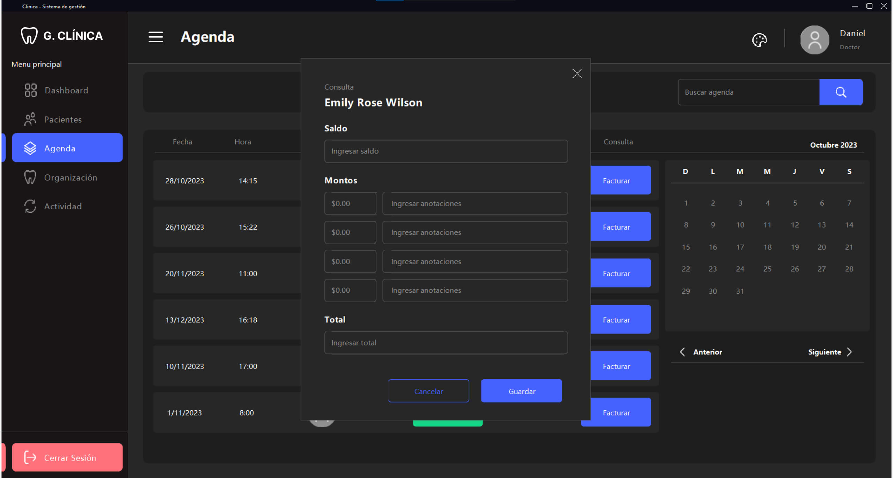

# Orthodontic and Dentistry Clinical Management


## Clinic Management Java Application


This Java application, developed from August 2022 to January 2023, was originally created to address the specific needs of a dental and orthodontic clinic. It provides efficient administration for a single doctor, streamlining the management of various aspects of the clinic's operations.

## Project Origin

This application was initially developed as a bespoke solution to meet the unique requirements of a dental and orthodontic clinic. It was designed to streamline the clinic's administrative processes, including patient management, appointment scheduling, record-keeping, and more.

## Project Overview

The application is tailored to the following features:

- **Patient Management:** Create and manage patient profiles, including contact details and medical history.
- **Patient Records:** Maintain detailed patient records, including treatment plans, X-rays, and invoices.
- **Appointments:** Schedule and manage patient appointments.
- **Invoices:** keeps invoices of patients' appointments.
- **Dental Charts (Odontograms):** Create and view dental charts for patients to track dental conditions and treatments.

## System Requirements

To run this application, you'll need to have the following components installed on your system:

- **Java:** Ensure you have Java installed on your system. You can download it [here](https://www.java.com/).
- **Java Swing:** This project uses Java Swing for the user interface.
- **SQL Server:** Configure the database connection to match your SQL Server setup.

Please note that you will also need to have the appropriate SQL Server JDBC drivers installed to connect to your database.

## Dependencies

To use this application, you'll need to include the [KControls library](https://github.com/k33ptoo/KControls), which is licensed under the Apache License 2.0.

## Running the Application

1. Open the project in NetBeans IDE.

2. Before running the application, ensure that the required SQL Server database is in place and correctly configured.

### Creating the Database

1. Locate the `orthodontic-dentistry-db.sql` file in the `database/` folder of your project.

2. Run the SQL script in your SQL Server Management Studio or a similar tool to create the database. This script will set up the required database structure.

### Configuring SQL Server Database Connection

1. Locate the `GenerateConnection.java` file in the `src/com/connection/` folder of your project.

2. Inside `GenerateConnection.java`, you'll find the following connection settings:

    ```java
    // Connection configuration
    private static String user = "user";        // Replace 'user' with your SQL Server username
    private static String password = "password"; // Replace 'password' with your SQL Server password
    ```

3. Save your changes in the `GenerateConnection.java` file.

### With the database in place and the connection settings updated, you're now ready to compile and run the application.

## License

This project is licensed under the MIT License. See the [LICENSE](LICENSE) file for details.

## Contact

Thank you for checking out the Orthodontic and Dentistry Clinical Management application. If you have any questions, encounter issues, or want to provide feedback, please feel free to reach out:

- Email: danielbatresuser@gmail.com

Your thoughts and suggestions are greatly appreciated!

## Application

Application interface views

### Welcome screen


### Pacients list


### Pacient profile


### Pacient schedule


### Odontogram


### Empty fields


### Invoices



### No results


